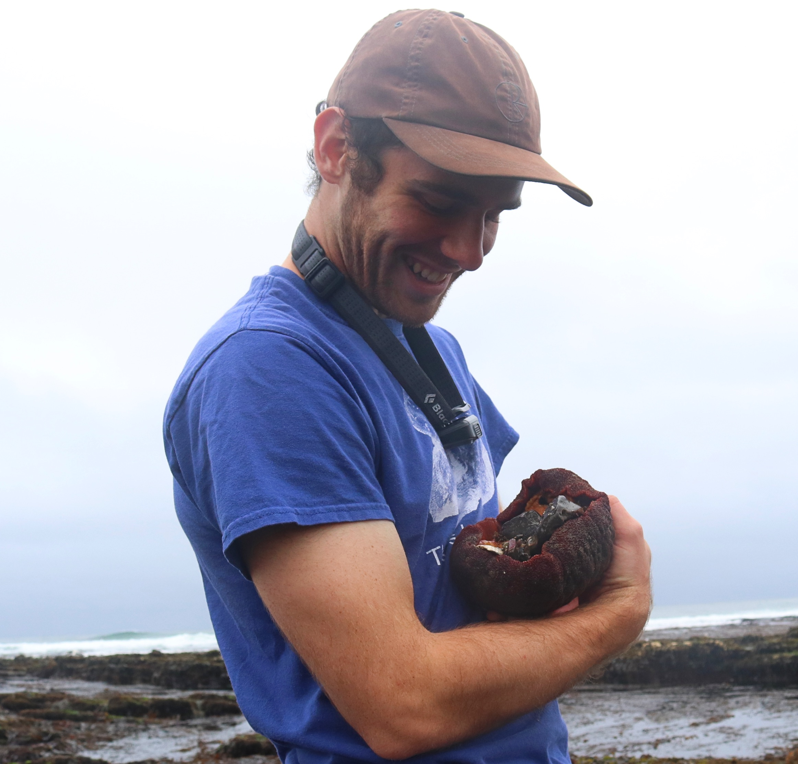
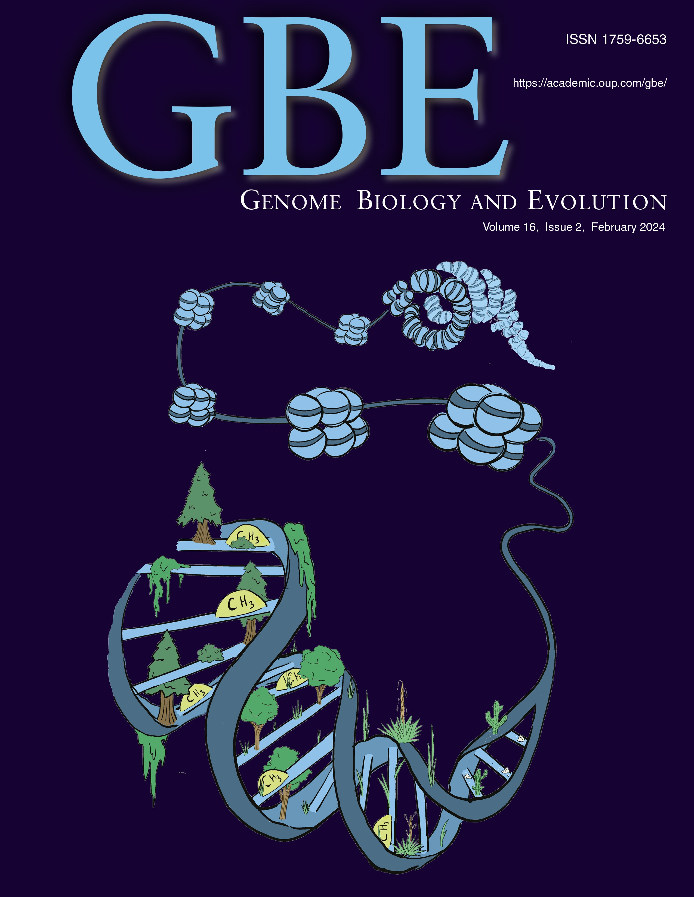
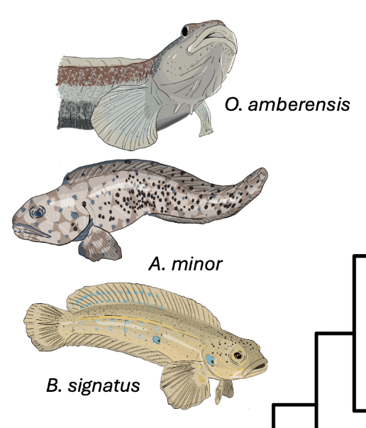

```{r, echo = FALSE, out.width='33%', out.extra='style="float:left; padding:10px"'}

```

### Research & Background

I'm an evolutionary biologist integrating physiology and genomics to understand the drivers and limits of environmental adaptation and acclimation. I study how the structure and variation of genomes and epigenomes constrains or facilitates adaptive evolution and phenotypic plasticity at molecular and organismal levels. I primarily pursue this research in marine animals such as polar ectotherms, coastal invertebrates, and deep sea fishes. While I also work to address fundamental biological questions, my training in marine ecology is fundamental to how I approach questions in physiological and molecular evolution.      

As a postdoctoral researcher at the University of California, Santa Cruz in the [Kelley Lab](https://evogenomes.sites.ucsc.edu/), I'm studying the evolution of antifreeze proteins in polar fishes through the lens of structural genomic variation. I completed my PhD at UC Santa Barbara where I studied the evolution and regulation of thermal acclimation. In my postdoc, I'm also continuing my research on phenotypic plasticity and acclimation's evolution by - and effect on - natural selection.

<br>

### Non-model Genomics

As a co-leader of the MarineOmics working group, I aim to promote training resources and methodological advancements for genomic research in marine and non-model species. Our website [marineomics.io](https://marineomics.github.io/) publishes markdown-style blog posts sharing tutorials, perspectives, and new methods related to population genomics, functional genomics, genome assembly, and genome-phenome mapping. Find out more under the [MarineOmics.io](https://snbogan.github.io/MarineOmics.html) tab. 

<br>

### Illustration

Scientific visuals can be much more than nice-looking graphs. I try to unify my passions for science and art through illustration. In 2024, my work was featured on the cover of *Genome Biology & Evolution* and can be found throughout my recent publications. 

<div style="clear: both;"></div>

```{r, echo = FALSE, out.extra='style="padding:10px"', results='asis'}
cat('<a href="https://academic.oup.com/gbe/article/16/2/evae022/7602727" target="_blank"></a>')

cat('<a href="https://besjournals.onlinelibrary.wiley.com/doi/10.1111/1365-2435.14568" target="_blank"></a>')

cat('<a href="https://www.biorxiv.org/content/10.1101/2024.08.24.609455v1" target="_blank"></a>')
```

