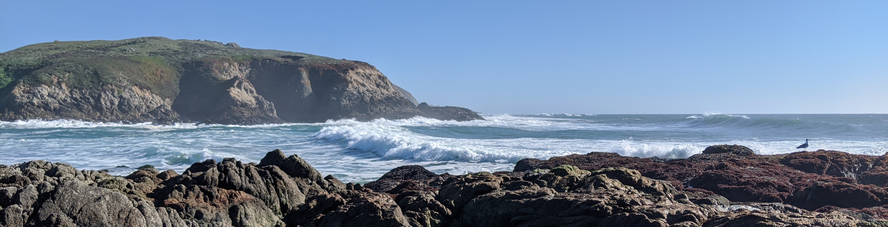

```{r, echo = FALSE}

```

<br>

### Articles in review or revision

**Bogan SN**, Surendran N\*, Hotaling S, Desvignes T, Bista I, Lins LSF, Eilertsen MH,  Le François NR, Algayer T, Hamilton SL, Frandsen PB, Hoffmann FG, and Kelley JL. 2024. [Temperature and Pressure Shaped the Evolution of Antifreeze Proteins in Polar and Deep Sea Zoarcoid Fishes](https://www.biorxiv.org/content/10.1101/2024.08.24.609455v2.abstract). *bioRxiv*. (in revision)

**Bogan SN**, Strader ME, and Hofmann GE. [Transgenerational effects alter the fitness consequences and genetic architecture of phenotypic plasticity and its regulatory pathways](https://www.biorxiv.org/content/10.1101/2024.10.07.617098v1). *bioRxiv*. (in revision)

**Bogan SN**, Sasaki M, and Kelley JL. Predicting Selection on Phenotypic Plasticity and Inferring Plasticity-first Evolution: Advances in Evolutionary Ecology and Genomics. (invited for special issue at  *Functional Ecology*; in revision)

Moosman OW\*, Kelley JK, **Bogan SN**. Mitigating Misassembly and Switch Errors in Pangenomes of Polar Fishes Reveals Haplotype Diversity in Copy Number of Antifreeze Protein Genes. (invited for special issue at *Heredity*; in review)

<br>

### Peer-reviewed articles

**Bogan SN**, Porat OI\*, Meneses M\*, and Hofmann GE. 2024. [Thermal Plasticity Has Greater Fitness Costs among Thermally Tolerant Genotypes of *Tigriopus californicus*](https://besjournals.onlinelibrary.wiley.com/doi/10.1111/1365-2435.14568). *Functional Ecology* 38: 1562–1577.


**Bogan SN** and Yi SV. 2024. [Potential Role of DNA Methylation in Plastic Responses to the Environment across Cells, Organisms, and Populations](https://academic.oup.com/gbe/article/16/2/evae022/7602727). *Genome Biology and Evolution* 16: evae022.


**Bogan SN**, Johns JW, Griffiths JS, Davenport DL, Schaal SM, Wuitchik SJS, Lotterhos KE, Lou RN, , McGirr JA, Downey-Wall AM, Rivera HE, Roberts SB, Puritz JB, and Silliman KE. 2023. [A dynamic web resource for robust and reproducible genomics in nonmodel species: marineomics.io](https://besjournals.onlinelibrary.wiley.com/doi/full/10.1111/2041-210X.14219). *Methods in Ecology and Evolution* 14: 2709–2716. 


**Bogan SN**, Strader ME, and Hofmann GE. 2023. [Associations between DNA Methylation and Gene Expression Depend on Chromatin Accessibility during Transgenerational Plasticity](https://bmcbiol.biomedcentral.com/articles/10.1186/s12915-023-01645-8). *BMC Biology* 21: 149. 


**Bogan SN**, Johnson KM, and Hofmann GE. 2020. [Changes in Genome-wide Methylation and Gene Expression in Response to Future *p*CO2 Extremes in the Antarctic Pteropod *Limacina helicina antarctica*](https://www.frontiersin.org/journals/marine-science/articles/10.3389/fmars.2019.00788/full). *Frontiers in Marine Science* 6: 788.


**Bogan SN** and Place SP. 2019. [Accelerated Evolution at Chaperone Promoters among Antarctic Notothenioid Fishes](https://bmcecolevol.biomedcentral.com/articles/10.1186/s12862-019-1524-y). *BMC Evolutionary Biology* 19: 205.


**Bogan SN**, McMahon JB, Pechenik JA, and Pires A. 2019. [Legacy of Multiple Stressors: Ocean Acidification and Nutrition in Larvae and Juveniles of a Marine Gastropod](https://www.journals.uchicago.edu/doi/10.1086/702993). *Biological Bulletin* 236: 159–173. 


\* = undergraduate mentee
