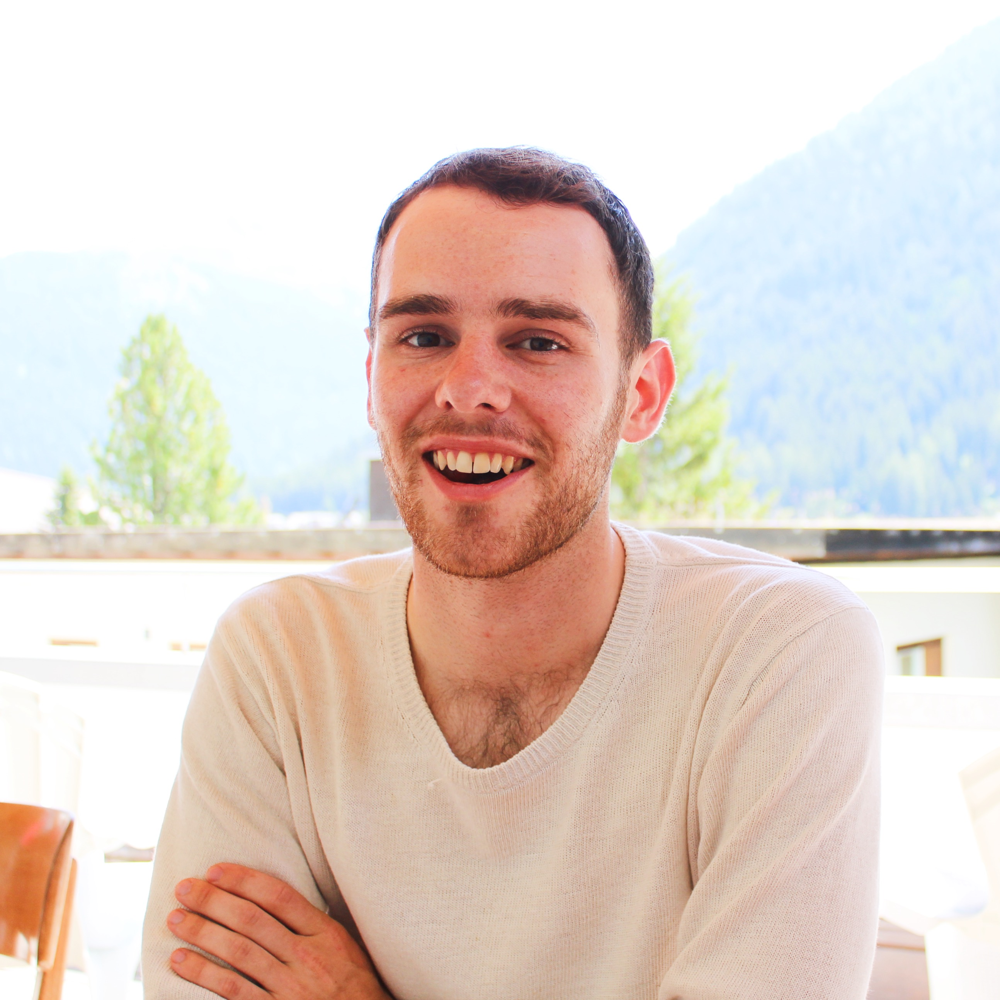

```{r setup, include=FALSE}

knitr::opts_chunk$set(echo = TRUE)

```
---
title: "Samuel N. Bogan, PhD"
---

You found my draft website!

<br>
```{r, echo = FALSE, out.width='45%', out.extra='style="float:left; padding:10px"'}

```

### Welcome <a id="about_me"></a>

Hello! I'm a marine evolutionary biologist integrating eco-physiology and genomics to understand drivers and limits of environmental adaptation and acclimation. While I'm interested in how organisms successfully adapt to novel environments, I'm just as interested in what holds them back. I seek to improve predictions of when biodiversity does or does not adapt to global change in our oceans. 

I recently started a postdoc at the University of California, Santa Cruz in the Kelley Lab. After completing my PhD at UC Santa Barbara where I studied the evolution and regulation of thermal acclimation, I'm currently studying convergent adaptations to extreme temperatures in fishes. 
<br>

