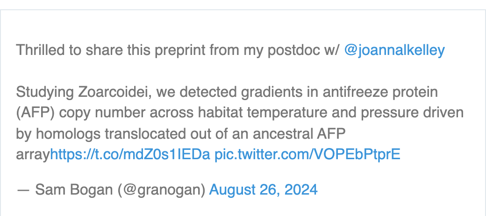

```{r setup, include=FALSE}

knitr::opts_chunk$set(echo = TRUE)

library(magick)
library(tweetrmd)
library(webshot2)

```

```{r, echo = FALSE}

# Annotate and print image
index_strip <- magick::image_read("images/Website_panel.png")

annotated_image <- image_annotate(index_strip, 
                                  text = 'Samuel N Bogan, PhD', 
                                  size = 300, 
                                  color = 'white',
                                  location = '+400+600') # X and Y offsets from the top-left corner

image_write(annotated_image, 'annotated_image.png')

```

```{r, echo = FALSE}
knitr::include_graphics("images/annotated_image.png")
```

<br>
```{r, echo = FALSE, out.width='33%', out.extra='style="float:left; padding:10px"'}

```

### Welcome <a id="about_me"></a>

I'm an evolutionary biologist integrating physiology and genomics to understand the drivers and limits of environmental adaptation and acclimation. 

I'm currently a postdoctoral researcher at the University of California, Santa Cruz in the [Kelley Lab](https://evogenomes.sites.ucsc.edu/) where I'm studying the evolution of antifreeze proteins in polar fishes through the lens of structural genomic variation.

<div style="clear: both;"></div>

<br>

### Latest News <a id="about_me"></a>

**August 26th, 2024** - The first paper from my postdoctoral research is out on bioRxiv! This work is currently in revision. 

[Temperature and Pressure Shaped the Evolution of Antifreeze Proteins in Polar and Deep Sea Zoarcoid Fishes](https://www.biorxiv.org/content/10.1101/2024.08.24.609455v1)

```{r, echo = FALSE, out.width=c('45%','25%'), results='asis'}
cat('<a href="https://x.com/granogan/status/1828157676116942957" target="_blank"></a>')


```


### Contact <a id="about_me"></a>

{width=25px} snbogan[at]ucsc.edu {width=25px} [@granogan](https://x.com/granogan) {width=25px} [@snbogan](https://github.com/snbogan) {width=25px} [Google Scholar](https://scholar.google.com/citations?user=4pu2BAUAAAAJ&hl=en)

**Office:** Coastal Biology Building Room 158 


