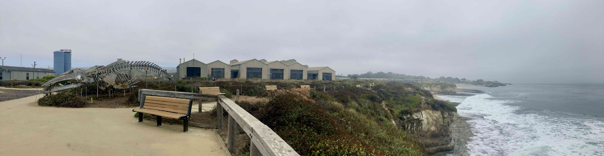
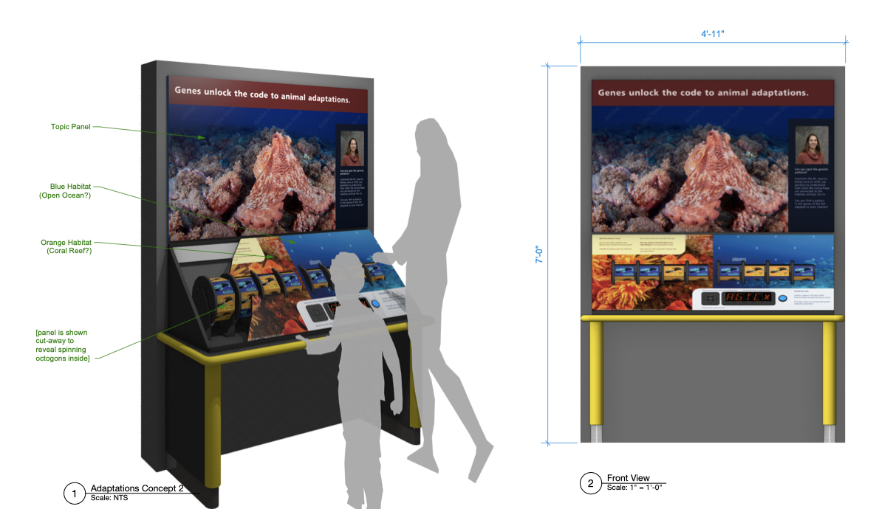

```{r, echo = FALSE}

```

## Public outreach

### Seymour Marine Discovery Center
Evolution isn't just a subject studied by biology majors, it shapes our lived experience and contemporary issues. Promoting evolutionary literacy allows the public to engage with and understand the COVID-19 pandemic, climate change, the antibiotic resistance crisis, and so much more. 


In collaboration with the [Seymour Marine Discovery Center](https://seymourcenter.ucsc.edu/) and [Dr. Joanna Kelley](https://evogenomes.sites.ucsc.edu/), we recently designed a digital and physical interactive exhibit for young learners about evolutionary biology. The exhibit introduces genes, their effects on traits, and how environents select for certain genes and traits. The exhibit is undergoing fabrication and will be installed in 2026!

{style="display:block; margin-left:auto; margin-right:auto; width:90%"}

A mock up of the kiosk-style interactive exhibit drafted by Bart Hays of [The Exhibits Dept.](https://www.exhibitsdept.com/our-team).

