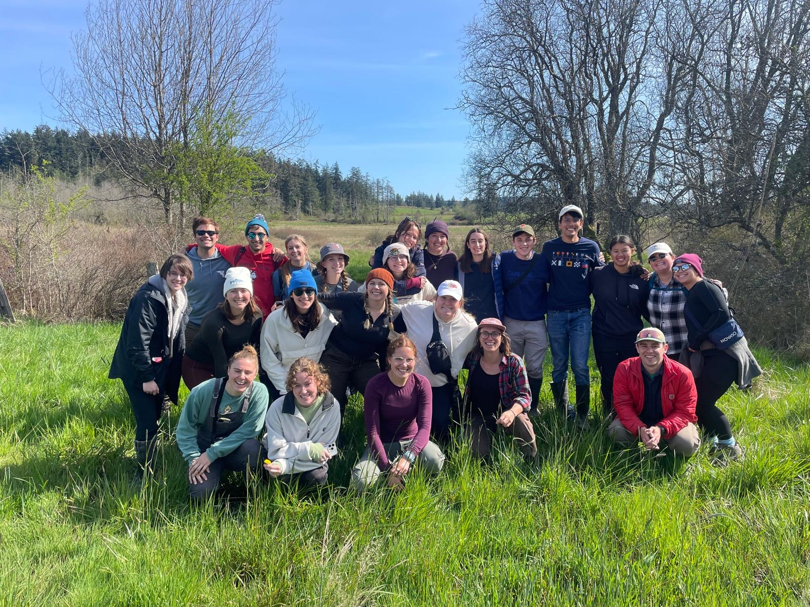
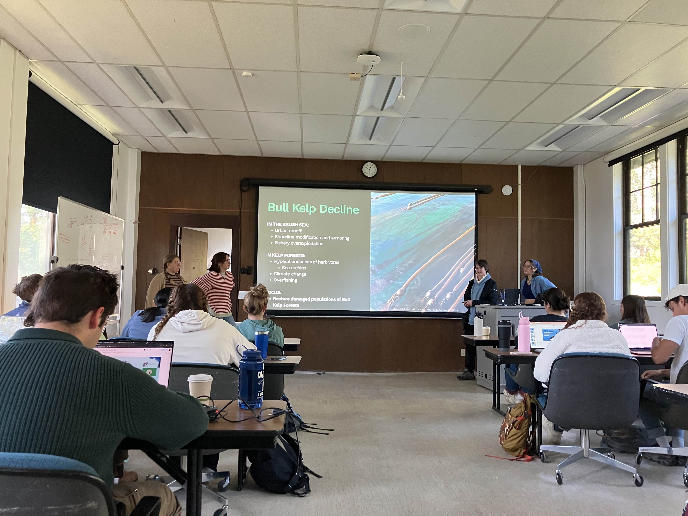
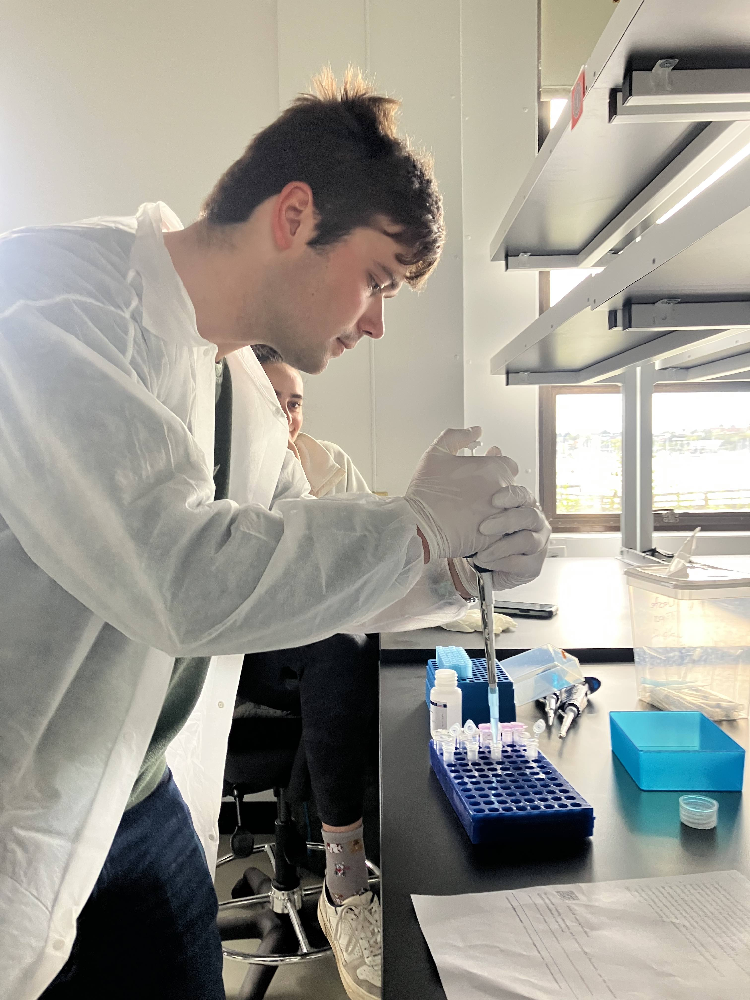
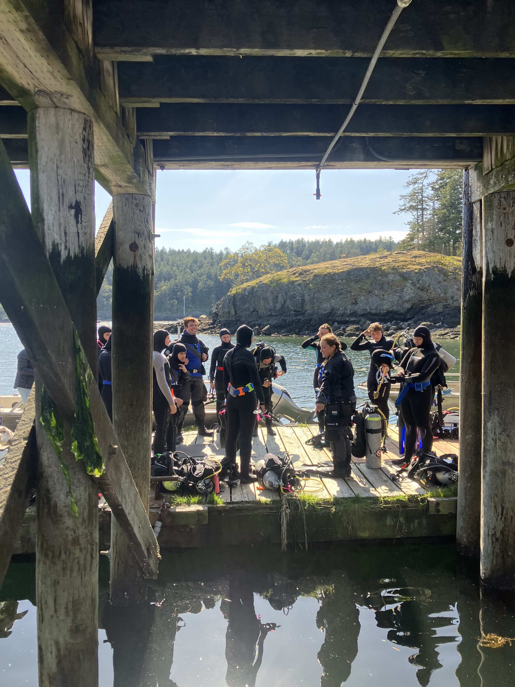

### Conservation genomics
I co-teach a field course with [Dr. Kai Kopecky](https://www.kailkopecky.com/), *Conservation & Restoration of Marine Systems*, where I introduce graduate and undergrad students from Northeastern University to field, lab, and computational approaches in conservation genomics. Over two weeks at Friday Harbor Labs, WA, students... 

1. Learn and apply population genetic theory
2. Design and conduct field transects and collections
3. Survey genetic diversity through DNA extraction and PCR
4. Reconstruct demography using genomic data and high-performance computing
5. Take field trips to restoration sites in the Puget Sound


This field course is part of Northeastern's Three Seas Program in Marine Biology and focuses on threatened marine populations. By co-teaching the course with Dr. Kopecky, a restoration ecologst, students are trained in how to make inferences about population health and ecosystem function by integrating methods in evolution and ecology. For example, students analyze real genomic, fitness, and functional trait data to test whether inbreeding depression influences trait-mediated ecological processes. 


The course caps off with a group paper and presentation. Students research and propose conservation and restoration approaches for threatened marine populations by integrating conservation genomics and restoration ecology.

```{r, echo = FALSE, out.extra='style="padding:10px"', results='asis'}

cat('<a href="" target="_blank"></a>')


cat('<a href="" target="_blank"></a>')

```

```{r, echo = FALSE, out.extra='style="padding:10px"', results='asis'}

cat('<a href="" target="_blank"></a>')

cat('<a href="" target="_blank"></a>')

```


